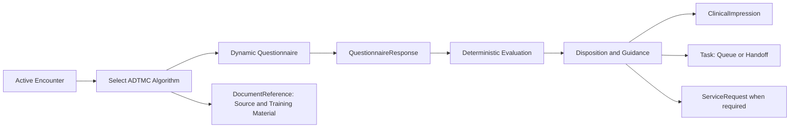
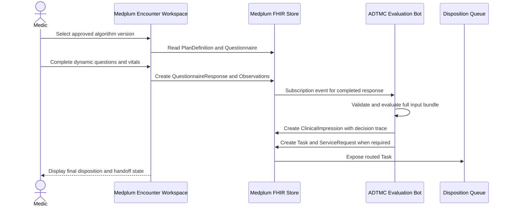

# ADTMC Dynamic Clinical Decision Support Implementation Plan

## Objective

Convert the 86 static Army ADTMC clinical algorithms into governed, dynamic
clinical decision-support workflows in Medplum. Each workflow must guide a
medic through the approved clinical questions, evaluate the captured evidence
deterministically, show the approved disposition, create the required clinical
handoff work, and retain a complete, versioned decision record.

This document is the definitive approved source for the 86 algorithms and their
disposition policies. This plan treats that approved clinical content as policy,
not application logic. Medplum implementation changes must faithfully translate
the source and are never unreviewed UI or code changes.

## Desired Clinical Experience

From an active encounter, an authorized medic selects the applicable ADTMC
algorithm. Medplum presents only the questions relevant to the answers already
given, including the red-flag screen. On completion, the workflow shows the
approved disposition and required next action, then documents and routes the
result in the encounter.

The initial disposition set is:

- Provider Now
- IDEP Now
- Specialty Referral
- Minor Care Protocols

The user sees the conclusion and approved guidance. The system retains the
questionnaire response, algorithm version, rule trace, resulting clinical
impression, and routed task for clinical review and audit.

## Pilot Scope

The first implementation is limited to **A-01 Sore Throat**. It is the sole
algorithm used to establish and validate the dynamic Medplum workflow before
any of the remaining 85 algorithms are translated or activated.

The A-01 pilot includes its approved questions, branching, red flags,
disposition, guidance, and routing behavior from this definitive source. It
must prove the complete content-to-runtime path: structured package,
questionnaire rendering, deterministic evaluation, `ClinicalImpression`,
`Task`/`ServiceRequest` routing when required, audit evidence, and operational
closure. The pilot does not authorize a generic algorithm runner without
source-fidelity evidence for A-01.

## Architecture Decision

Use FHIR resources as the source of truth for algorithm content, clinical
execution, and routing. Do not embed algorithm questions, answer choices,
branching rules, or disposition mapping in individual provider-app screens.

| Concern | Medplum/FHIR representation | Responsibility |
| --- | --- | --- |
| Algorithm identity and lifecycle | `PlanDefinition` | Canonical ID, semantic version, owner, approval, effective dates, and linked artifacts. |
| Medic interaction | `Questionnaire` | Versioned questions, answer sets, required fields, and straightforward conditional visibility. |
| Encounter-specific answers | `QuestionnaireResponse` | Immutable answer record linked to the encounter, patient, algorithm, and questionnaire version. |
| Objective inputs | `Observation` | Vitals and other clinical measurements referenced by the decision. |
| Rule evaluation | Medplum Bot | Authoritative deterministic evaluation for multi-step rules, scoring, and disposition selection. |
| Decision summary | `ClinicalImpression` | Disposition, rationale, protocol version, evidence references, and any authorized override. |
| Work routing | `Task` | Queue/assignee, priority, state, escalation, claim, and closure workflow. |
| Follow-on clinical action | `ServiceRequest` | Referral, order, or required service arising from a disposition. |
| Source and training material | `DocumentReference` | Approved algorithm PDF, supplemental guidance, MEDCOM material, and training references. |

`Questionnaire.enableWhen` is used for simple question visibility. It is not the
authoritative clinical rule engine. A versioned Medplum Bot evaluates the
complete response and related observations after submission so the same input
bundle always produces the same disposition.

## Algorithm Package Contract

Every algorithm version must publish as a complete package before it becomes
available in the encounter workflow.

| Required element | Representation | Rule |
| --- | --- | --- |
| Stable algorithm identifier | `PlanDefinition.identifier` | Never changes across versions. |
| Version and lifecycle | `PlanDefinition.version`, status, effective period | Draft, approved/active, retired; active versions are immutable. |
| Approval and ownership | Extensions or linked provenance | Capture approving authority, approver, and approval date. |
| Question flow | `Questionnaire` | Carries the versioned questions and answer options. |
| Rule table | Versioned structured artifact referenced by `PlanDefinition` | Maps normalized inputs to one disposition and guidance set. |
| Disposition policy | `PlanDefinition.action` and referenced configuration | Defines priority, target queue, signature, documentation, and follow-on action. |
| Source material | `DocumentReference` | Linked original, supplemental, and training documents. |
| Test cases | Structured fixture set | Includes expected disposition and routing for representative, red-flag, boundary, and invalid cases. |

The structured rule table may be maintained as a controlled FHIR `Library`
artifact or JSON attachment referenced by the `PlanDefinition`. The selection
must be made once during the pilot and applied consistently. It must be
machine-readable, reviewable by clinicians, versioned, and executable by the
authoritative Bot.

## Runtime Contract

1. The encounter workspace offers only active algorithms applicable to the
   encounter context and authorized user role.
2. The app reads the selected `PlanDefinition` and its approved
   `Questionnaire`; it creates a `QuestionnaireResponse` linked to that exact
   version.
3. The medic records required answers and objective values. Simple branches
   hide irrelevant questions, but all required red-flag and completion checks
   are enforced before evaluation.
4. A Medplum `Subscription` invokes the evaluation Bot only when the response
   is complete. The Bot validates references, resolves the exact rule package,
   and evaluates the complete evidence bundle.
5. The Bot creates one `ClinicalImpression` containing the algorithm ID,
   algorithm version, disposition, rationale, evaluated input references, and
   a machine-readable decision trace.
6. The Bot creates or updates `Task` resources and, where specified, a
   `ServiceRequest`. The routing policy determines queue, priority, escalation,
   required signature, and closure conditions.
7. The encounter workspace renders the immutable result and routed work. A
   provider claims and completes the task through normal Task state changes.

## Disposition Routing Policy

Routing must be configuration data associated with an approved algorithm
version, not role-specific logic in the application.

| Disposition | Required routing policy |
| --- | --- |
| Provider Now | High-priority Task to the immediate provider queue, with escalation timer and visible encounter link. |
| IDEP Now | High-priority Task to the IDEP queue, with equivalent handoff and escalation evidence. |
| Specialty Referral | Specialty-queue Task plus a `ServiceRequest` and scheduling follow-up policy. |
| Minor Care Protocols | Required co-sign/closure Task and constraints identifying the permitted treatment path. |

Each policy explicitly defines the target queue or assignment strategy,
priority, escalation timer, encounter-state effect, signature requirements,
closure criteria, and mandatory documentation. Facility-specific routing is a
separately versioned configuration release; it does not alter clinical
disposition logic.

## Governance, Security, And Audit

- Maintain draft, active, and retired lifecycle states. Do not edit an active
  algorithm, questionnaire, rule table, or routing policy in place.
- Limit authoring, review, approval, publication, and retirement permissions to
  designated clinical-governance roles using Medplum `AccessPolicy`.
- Require independent implementation review for every source-to-structured
  translation and every revised algorithm version. The review verifies fidelity
  to the approved source; it does not re-approve the clinical algorithm.
- Record `Provenance` for authoring, approval, publication, and retirement
  actions.
- Record algorithm ID and exact version on every `QuestionnaireResponse`,
  `ClinicalImpression`, routing `Task`, and authorized override.
- Preserve the evaluated evidence references and rule trace. A historic case
  must be replayable against the exact package version used at the time.
- Prohibit a medic from silently changing an evaluated disposition. An override
  creates a new, explicitly attributed record with reason and supervisor
  attribution; it does not alter the Bot result.

## Work Slices

### Slice 1: Source Inventory And Clinical Governance

**Deliverable:** a governed inventory for all 86 algorithms and an
implementation-translation publication standard.

- Assign each source artifact a stable algorithm ID, owning authority, source
  location, source revision, clinical owner, and implementation status.
- Classify each algorithm by complexity: questionnaire-only, scored,
  multi-branch, observation-dependent, or disposition/routing dependent.
- Establish the canonical translation template, implementation-review workflow,
  versioning convention, lifecycle states, and dual-review requirement.
- Translate the already-approved four core disposition contracts into explicit
  Medplum routing configuration before any broad content build.
- Identify source gaps, ambiguous rendering details, and algorithms requiring
  implementation clarification before translation.

**Verification criteria:** exactly 86 inventory records exist; each has an
owner, source, version/revision, classification, and disposition mapping; no
algorithm is eligible for publication without source-fidelity review and test
cases.

### Slice 2: FHIR Profiles, Terminology, And Content Package

**Deliverable:** deployable FHIR profiles, terminology, and a versioned ADTMC
content-package convention.

- Define profiles/extensions for the algorithm package references, decision
  trace, disposition, override attribution, and routing policy.
- Create or bind `ValueSet` resources for answers, dispositions, priorities,
  queues, specialties, and algorithm lifecycle states.
- Define `PlanDefinition`, `Questionnaire`, `ClinicalImpression`, and `Task`
  profiles with required links and cardinalities.
- Build the package validator that blocks missing or inconsistent references,
  inactive terminology, incomplete routing policy, or absent test cases.
- Publish the A-01 Sore Throat package as the first implementation package.

**Verification criteria:** the A-01 Sore Throat package validates through Medplum; all
references resolve to the same approved version; invalid, incomplete, or
unapproved content cannot be activated.

### Slice 3: Deterministic Evaluation And Routing Runtime

**Deliverable:** one reusable Medplum Bot and Subscription-driven runtime that
evaluates approved packages and creates documented outcomes.

- Define the Bot input contract for a completed `QuestionnaireResponse`,
  encounter context, and referenced observations.
- Implement deterministic evaluation from the versioned rule table and return
  one disposition, guidance set, and trace.
- Create `ClinicalImpression`, `Task`, and optional `ServiceRequest` resources
  through a single idempotent execution path.
- Implement configured Provider Now, IDEP Now, Specialty Referral, and Minor
  Care Protocols routing policies.
- Implement attributed override handling without altering the original result.

**Verification criteria:** repeat evaluation of the same fixture produces the
same disposition and trace; duplicate events do not duplicate handoff Tasks;
each core disposition creates the configured resources, priority, and queue.

### Slice 4: Dynamic Encounter Form Experience

**Deliverable:** an encounter-integrated Medplum form experience for active
algorithm packages.

- Present active algorithms by encounter context, user authorization, and
  applicability criteria from `PlanDefinition`.
- Render the selected `Questionnaire` using Medplum's native questionnaire
  components and `enableWhen` behavior for straightforward branching.
- Capture required observations and answers with explicit completion and
  red-flag validation.
- Display the completed disposition, guidance, source references, decision
  trace summary, and routed Task state in the encounter context.
- Ensure the experience references configuration resources rather than
  hard-coded algorithm-specific UI behavior.

**Verification criteria:** a medic completes A-01 Sore Throat within an active
encounter; only relevant questions display; red-flag paths are conspicuous;
the final result and handoff state are visible without navigating away from the
encounter.

### Slice 5: Translation Factory And Implementation Verification

**Deliverable:** a repeatable, dual-reviewed process that converts all 86
static algorithms into source-faithful, validated content packages.

- Extract each source algorithm into the translation template, preserving
  question wording, logic, thresholds, disposition, and references.
- Independently verify each structured package against this definitive source.
- Create traceable test fixtures for normal, red-flag, boundary, contradictory,
  and incomplete-answer cases.
- Publish algorithms in clinically coherent cohorts only after content,
  runtime, and routing tests pass.
- Track translation and approval state in the canonical inventory; reject
  partial package publication.

**Verification criteria:** every published algorithm has signed source-fidelity
evidence, reviewed test fixtures, successful runtime results, and linked source
material; the inventory reconciles to 86 without duplicates or unaccounted
artifacts.

### Slice 6: Pilot, Release, And Operations

**Deliverable:** a controlled production rollout and operational model for
algorithm updates, audit, and quality review.

- Pilot A-01 Sore Throat first. Exercise every disposition and routing path
  that the approved A-01 algorithm defines, including its red-flag and
  boundary cases.
- Conduct usability, clinical-safety, routing, and audit reviews with medics,
  providers, queue owners, and clinical governance.
- Set activation, rollback, incident, override-review, and periodic
  revalidation procedures.
- Release approved cohorts progressively, monitoring route latency, task
  completion, override rate, evaluator errors, and content-version adoption.
- Establish recurring governance review for source revisions and retired
  algorithm packages.

**Verification criteria:** pilot cases route correctly through closure; the
team can retrieve the full decision record for an audited case; rollback
removes an algorithm from selection without altering historical responses;
release evidence demonstrates each production cohort faithfully implements the
approved source.

## Delivery Sequence

The work proceeds in dependency order:

1. Complete the 86-algorithm inventory and establish the implementation
  translation and verification contract.
2. Establish profiles, terminology, package validation, and the A-01 Sore
  Throat implementation package.
3. Deliver the evaluator and routing runtime for A-01.
4. Integrate the A-01 dynamic questionnaire into the encounter workspace.
5. Validate A-01 end to end in the isolated test environment, including all
  of its approved branches and operational handoffs.
6. Use the A-01 evidence to translate and publish source-faithful, validated
  cohorts from the remaining 85 algorithms.
7. Release progressively under clinical governance and operational monitoring.

No additional algorithm may be activated until A-01 has passing source-fidelity,
runtime, routing, audit, and operational-closure evidence. A-01 is the proving
ground for the content package, evaluator, and handoff model; it does not by
itself validate clinical logic for the remaining algorithms.

## Acceptance Criteria

- All 86 source algorithms are accounted for in a governed inventory.
- Each active algorithm has an immutable, machine-readable package that
  faithfully implements the approved source, with a stable identifier, version,
  source evidence, test cases, and routing policy.
- Authorized users can complete applicable algorithms dynamically within an
  active Medplum encounter.
- The same approved input bundle always produces the same disposition and
  routing result for its exact algorithm version.
- Red flags, incomplete data, invalid references, and unapproved packages block
  finalization rather than produce an ambiguous clinical result.
- Every final decision has traceable `QuestionnaireResponse`, observation,
  `ClinicalImpression`, and required `Task`/`ServiceRequest` evidence.
- Manual overrides are explicit, attributed, reasoned, and do not mutate the
  original automated decision.
- Historical decisions remain understandable and replayable after future
  algorithm revisions or retirement.

## Key Decisions Needed Before Implementation

1. Create the 86-algorithm inventory from this definitive source, assigning
  each algorithm a stable implementation identifier, complexity classification,
  and test-fixture set.
2. Name the implementation translators and independent reviewers who verify
  source fidelity before a Medplum package is activated.
3. Configure the already-approved Provider Now, IDEP Now, Specialty Referral,
  and Minor Care Protocols policies with their exact Medplum queues,
  priorities, escalation timers, signature rules, and closure conditions.
4. Provision an isolated synthetic-patient test environment with the medic,
   provider, IDEP, specialty, scheduler, and queue roles needed to validate
   every A-01 Sore Throat outcome end-to-end.
5. Decide whether the structured rule table is a profiled FHIR `Library` or a
   governed JSON attachment referenced from `PlanDefinition`.