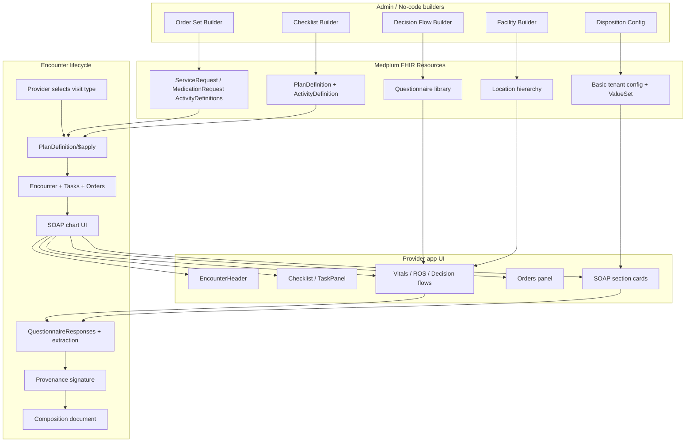

# HiiveHealth SOAP Note in Medplum — Work Slices

Last updated: 2026-07-13

## Goal

Replicate the HiiveHealth encounter-chart SOAP note in Medplum using native FHIR resources and a minimal custom layout shell.

## Architectural overview

## Phase 1 — Foundation

| Slice | Description | Output | Effort | Status |
|-------|-------------|--------|--------|--------|
| 1.1 | Create sample `Location` hierarchy (building → floor → room → station) for one facility | Seed data + documentation | Small | Done |
| 1.2 | Add cascading Location selectors to `EncounterChart` and save selected station to `Encounter.location` | Updated chart UI | Small | Done |
| 1.3 | Verify `EncounterChart` loads and saves location correctly | Test + demo | Small | Pending |

## Phase 2 — Visit type and checklist

| Slice | Description | Output | Effort | Status |
|-------|-------------|--------|--------|--------|
| 2.1 | Define one Hiive visit type (e.g., Sick Call) as a `PlanDefinition` | `PlanDefinition` resource | Small | |
| 2.2 | Define checklist items as `ActivityDefinition` (`kind: "Task"`) | `ActivityDefinition` resources | Small | |
| 2.3 | Confirm `PlanDefinition/$apply` creates `Task`s and renders in `TaskPanel` | Working checklist | Small | |
| 2.4 | Decide checklist is advisory (does not block signing) and document | Design decision recorded | Tiny | |

## Phase 3 — SOAP section questionnaires

| Slice | Description | Output | Effort | Status |
|-------|-------------|--------|--------|--------|
| 3.1 | Create separate `Questionnaire`s for Subjective, Objective, Assessment, Plan | 4+ `Questionnaire` resources | Medium | |
| 3.2 | Add Review of Systems `Questionnaire` with grouped systems | ROS `Questionnaire` | Small | |
| 3.3 | Render each `Questionnaire` inside a Mantine card in `EncounterChart` | Updated chart layout | Medium | |
| 3.4 | Save each `QuestionnaireResponse` and link to `Encounter` | Persisted responses | Small | |

## Phase 4 — Extraction and clinical resources

| Slice | Description | Output | Effort | Status |
|-------|-------------|--------|--------|--------|
| 4.1 | Implement `$extract` or Bot to convert Subjective responses to `Observation`s | Extraction Bot / logic | Medium | |
| 4.2 | Extract ROS responses to per-system `Observation`s | Extraction logic | Medium | |
| 4.3 | Extract Assessment responses to `Condition` resources | Extraction logic | Medium | |
| 4.4 | Extract Plan responses to `CarePlan` and update `Encounter.hospitalization.dischargeDisposition` | Extraction logic | Medium | |
| 4.5 | Track extracted resource IDs for later Composition assembly | Reference tracking | Small | |

## Phase 5 — Vitals and orders

| Slice | Description | Output | Effort | Status |
|-------|-------------|--------|--------|--------|
| 5.1 | Create vitals `Questionnaire` or direct form that produces LOINC-coded `Observation`s | Vitals capture + `Observation`s | Small | |
| 5.2 | Build "+ Order" UI supporting meds, labs, imaging, procedures, immunizations, and order sets | Orders panel | Medium | |
| 5.3 | Implement order set application via `PlanDefinition/$apply` | Order set integration | Small | |
| 5.4 | Display placed orders in chart | Orders list | Small | |

## Phase 6 — Disposition and tenant configuration

| Slice | Description | Output | Effort | Status |
|-------|-------------|--------|--------|--------|
| 6.1 | Create `Basic` tenant config resource for disposition toggle + `ValueSet` reference | Config schema | Small | |
| 6.2 | Build admin UI to toggle disposition and edit disposition list | Admin screen | Medium | |
| 6.3 | Wire `Questionnaire.enableWhen` to hide/show disposition item based on tenant config | Conditional rendering | Small | |
| 6.4 | Extract disposition answer to `Encounter.hospitalization.dischargeDisposition` | Extraction logic | Small | |

## Phase 7 — Clinical decision flows

| Slice | Description | Output | Effort | Status |
|-------|-------------|--------|--------|--------|
| 7.1 | Create 1–2 sample decision-flow `Questionnaire`s | Decision flow resources | Small | |
| 7.2 | Add Clinical Decision Flows dropdown to chart | Dropdown UI | Small | |
| 7.3 | Render selected decision flow inline and extract responses | Inline flow + extraction | Medium | |

## Phase 8 — Signing and final document

| Slice | Description | Output | Effort | Status |
|-------|-------------|--------|--------|--------|
| 8.1 | Confirm Sign / Sign & Close creates `Provenance` and sets `ClinicalImpression.status` = `completed` | Existing flow verified | Small | |
| 8.2 | Generate `Composition` referencing all extracted resources during Sign & Close | Signed SOAP document | Medium | Done |

## Phase 9 — Polish and scale

| Slice | Description | Output | Effort | Status |
|-------|-------------|--------|--------|--------|
| 9.1 | Add loading/error states to chart sections | UX polish | Small | |
| 9.2 | Support multiple visit types beyond Sick Call | Additional `PlanDefinition`s | Medium | |
| 9.3 | Tenant-scope questionnaires and order sets per organization | Multi-tenant config | Medium | |
| 9.4 | End-to-end test with synthetic patients from `hiivecare-dev-data-pipeline` | Validated flow | Medium | |

## Risks and mitigations

| Risk | Mitigation |
|------|------------|
| Extraction Bots become complex | Start with one section; reuse extraction patterns across sections |
| Many resources to manage per tenant | Use naming conventions and `identifier` tags to scope by organization |
| Native `QuestionnaireForm` doesn't match Hiive UX | Accept a Mantine card layout shell; avoid custom inputs/validation |
| Order panel spans multiple resource types | Build a unified facade component that queries `ServiceRequest`, `MedicationRequest`, etc. |
| Location selector requires cascading API calls | Load floor/room/station lazily based on parent selection |

## Definition of done

- Provider can create a Sick Call encounter from a `PlanDefinition`.
- Checklist `Task`s appear and can be completed without blocking sign.
- Subjective, Objective, Assessment, Plan, Vitals, and ROS sections render as cards.
- Responses extract into `Observation`, `Condition`, `CarePlan`, and `ServiceRequest`.
- Orders (individual + order sets) can be added and viewed.
- Patient disposition can be toggled per tenant and selected from a tenant-defined list.
- Sign / Sign & Close creates `Provenance`, completes the `ClinicalImpression`, and generates a signed `Composition`.
