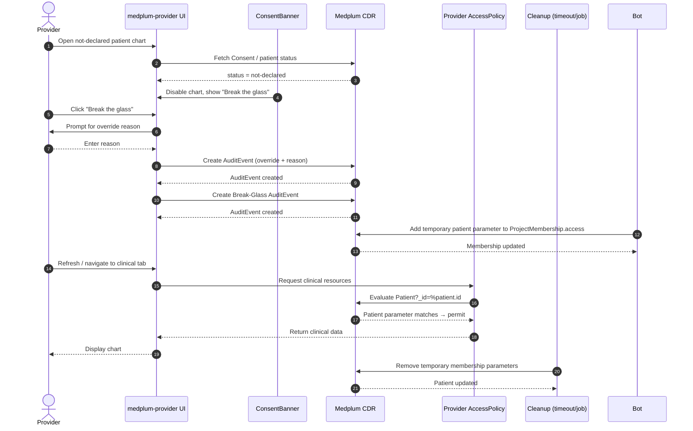

# Nevada HIE Demo — Break-the-Glass Enforcement Options

**Context**: The Nevada HIE demo shows a patient chart even when the patient has not declared a consent preference (`not-declared`). The presenter clicks **Break the glass**, enters a reason, and the chart becomes visible. This document describes four ways to enforce the "no clinical data until break-the-glass" rule, ordered from simplest/least-secure to most-complete.

---

## Option 1: Frontend gating only (quickest, demo-only)

Use the existing `usePatientConsent` hook in the `ConsentBanner` component to conditionally hide chart content until break-glass is recorded.

### How it works

- `ConsentBanner.tsx` already resolves the patient's consent status from a `Consent` resource.
- Extend the logic so that `PatientPage.tsx` does not render `<Outlet />` / `TimelineTab` / clinical tabs while status is `not-declared` and no break-glass `AuditEvent` exists for the current user.
- After the user clicks **Break the glass** and an `AuditEvent` is created, the UI re-renders and shows the chart.

### Pros

- Fastest to implement.
- No backend or AccessPolicy changes required.
- Smooth UX for the demo presenter.

### Cons

- Not secure. A user with a FHIR token can still call the Medplum API directly and retrieve clinical data.
- Only suitable for UI demos, not production or certification.

### Files involved

- `medplum-provider/src/hooks/usePatientConsent.ts`
- `medplum-provider/src/components/consent/ConsentBanner.tsx`
- `medplum-provider/src/pages/patient/PatientPage.tsx`

---

## Option 2: Medplum AccessPolicy + temporary parameterized membership access

This is the production pattern for this deployment: a restricted Medplum `AccessPolicy` is assigned to the provider, and Break-Glass temporarily adds a patient parameter to that provider's `ProjectMembership.access` entry. The policy resolves `%patient.id` and limits the provider to that patient's compartment.

### How it works

1. Provider opens a `not-declared` patient chart and sees a disabled chart.
2. Provider clicks **Break the glass** and enters a reason.
3. The app creates an `AuditEvent` documenting the override.
4. A privileged Medplum Bot updates the provider's `ProjectMembership.access` entry with a temporary patient parameter and expiration parameter.
5. The provider AccessPolicy includes parameterized criteria such as:
   ```text
   Patient?_id=%patient.id
   Encounter?_compartment=Patient/%patient.id
   ```
   The membership parameter substitution limits the provider to the approved patient compartment.
6. After expiration, a scheduled cleanup Bot removes the temporary membership parameters.

### Sequence flow



### Pros

- Uses native Medplum authorization primitives.
- Aligns with Medplum's ONC d6 emergency access certification guidance.
- Backend-enforced: direct API calls are also blocked without the temporary relationship.

### Cons

- Requires managing parameterized `ProjectMembership.access` entries and their lifecycle.
- The UI may need a refresh after the relationship is added before Medplum re-evaluates the AccessPolicy.
- Cleanup logic must be reliable (timeout, scheduled job, or session-end hook).

### Files involved

- `medplum-ubix/scripts/apply-nevada-break-glass-policy.mjs` — deploy the restricted parameterized policy.
- `medplum-provider/src/bots/nevadaBreakGlassAccess.ts` — privileged activation Bot.
- `medplum-provider/src/utils/audit.ts` — ensure `AuditEvent` is created.
- `medplum-provider/src/bots/nevadaBreakGlassCleanup.ts` — scheduled cleanup Bot.

---

## Option 3: Custom server-side authorization wrapper

Build a HiiveCare-specific middleware or proxy between `medplum-provider` and the Medplum CDR. The wrapper evaluates consent and break-glass status before forwarding clinical-resource requests.

### How it works

1. All provider-app FHIR requests route through the wrapper.
2. For requests involving a patient, the wrapper checks:
   - Does an active `Consent` with `provision.type = permit` exist?
   - If consent is `not-declared`, has the current user recorded a valid break-glass `AuditEvent` for that patient?
3. If neither condition is met, the wrapper returns `403 Forbidden`.
4. If break-glass exists, the wrapper forwards the request and records an additional access `AuditEvent`.

### Pros

- Strongest enforcement: works for all API consumers, not just the React app.
- Can implement HiiveCare-specific business logic (e.g., time-limited override, reason validation).
- Does not depend on Medplum AccessPolicy limitations.

### Cons

- Most development effort.
- Adds a new service/component that must be maintained.
- Duplicates some authorization responsibilities already handled by Medplum.

### Components involved

- New middleware/proxy service (e.g., Express, Fastify, or API Gateway Lambda).
- Consent and `AuditEvent` lookup logic.
- Updated provider app to route through the wrapper.

### Could AWS Cognito replace this?

AWS Cognito is an **identity** service, not an **authorization** service. It can authenticate users and issue JWTs, but it does not understand patient-specific `Consent` resources or break-glass `AuditEvent`s.

So Cognito **cannot directly substitute** for Option 3. However, it can be part of the same architecture:

- **Cognito** authenticates the provider and provides a signed token (who they are).
- **API Gateway** with a **Cognito authorizer** verifies the token at the edge.
- A **Lambda authorizer** (or Lambda proxy integration) then performs the consent/break-glass check (what they may access).
- If the check passes, the request is forwarded to Medplum; otherwise it returns `403 Forbidden`.

In short: Cognito handles authentication; the custom wrapper/authorizer still handles the break-glass authorization decision.

---

## Option 4: Medplum Bot + Subscription

Use a Medplum Bot triggered by an `AuditEvent` creation (break-the-glass) to update the patient's permissions or add a temporary flag. A Subscription listens for break-glass events and executes the Bot.

### How it works

1. Provider clicks **Break the glass**.
2. The app creates an `AuditEvent` with code `BREAK_GLASS`.
3. A Medplum Subscription on `AuditEvent?type=BREAK_GLASS` invokes a Bot.
4. The Bot updates the patient — for example:
   - Adds a temporary extension flag.
   - Adds a temporary patient parameter to `ProjectMembership.access` (similar to Option 2).
   - Updates a project-specific `Group` or AccessPolicy parameter.
5. The provider AccessPolicy criteria reference the updated patient field or parameter.

### Pros

- Server-side and event-driven.
- Keeps break-glass logic out of the frontend.
- Can be combined with Option 2 for full backend enforcement.

### Cons

- Subscriptions require WebSocket or REST delivery, which may not be enabled in the local build.
- Adds operational complexity (Bot deployment, Subscription management).
- Slight asynchronous delay between break-glass action and permission update.

### Components involved

- Medplum Bot code (TypeScript/JavaScript deployed to Medplum).
- Medplum Subscription resource.
- Updated AccessPolicy criteria.

---

## Recommendation

| Goal | Recommended option |
|---|---|
| Fast demo fix this week | **Option 1** with clear documentation that backend enforcement is pending. |
| Credible production-aligned demo | **Option 2** — uses Medplum ONC-certified emergency access pattern. |
| Maximum security / multi-client enforcement | **Option 3** — custom authorization wrapper. |
| Event-driven, server-side enforcement | **Option 4** (if Subscriptions are enabled) or combine with Option 2. |

For the Nevada HIE production architecture, use a **hybrid model**: Medplum `AccessPolicy` remains the baseline authorization control, while a narrowly scoped server-side consent gateway performs synchronous patient-level consent and Break-Glass evaluation that the current Medplum policy validator cannot express directly. This must be reviewed by the certification owner; no implementation choice automatically preserves ONC certification.

## Production Implementation Work Slices

The selected production approach is:

- Medplum `AccessPolicy` as the authorization enforcement point
- temporary parameterized provider membership access for approved emergency access
- Medplum Bot and Subscription automation for lifecycle management where supported
- `AuditEvent` and `Provenance` for access, reason, relationship, and cleanup records
- a narrowly scoped server-side consent gateway for dynamic patient-level decisions

### Production Duration And Automation Decision

- There is no universal EHR-wide Break-Glass duration standard. Production systems generally use a short, policy-configurable window with explicit expiration and audit.
- The Nevada baseline is `1 hour`, configurable through deployment policy. A shorter duration may be appropriate for a narrowly defined emergency workflow; extensions should require a new reason and audit event.
- A native Medplum `Subscription` is an event-delivery mechanism: it watches a FHIR criteria query and pushes matching resource changes through a configured channel such as REST hook or WebSocket.
- A Subscription is useful for near-real-time notification or downstream processing, but it is not a timer and cannot replace scheduled expiration cleanup.
- The production design therefore uses `AccessPolicy` as the authorization control and a scheduled Medplum Bot as the authoritative expiration/cleanup mechanism. A Subscription may be added as a supplementary event trigger after its delivery channel and retry behavior are validated in the target deployment.

### Current Implementation Baseline

The current Nevada demo provider policy is not yet production enforcement. The live policy currently grants broad provider interactions across patient and clinical resources, while the demo application uses frontend consent gating and Break-Glass audit records. It does not yet enforce the restricted, parameterized membership policy or the server-side consent gateway described below.

Therefore:

- frontend chart hiding remains demo-only behavior
- the current provider `AccessPolicy` must not be represented as production-ready Break-Glass enforcement
- Slice 1 must be completed and tested before enabling the production policy for real users
- the existing broad demo policy should remain unchanged until the replacement policy has passed direct API denial and authorization tests

Implementation status after Slice 1 and Slice 2 work:

- A local AccessPolicy contract fixture and credential-free tests now capture the intended profile-scoped patient relationship criteria.
- The provider Break-Glass request flow now re-checks that consent is still `not-declared` at submit time.
- The provider Break-Glass request flow now requires an authenticated `Practitioner` or `PractitionerRole` profile.
- The current UI still records the demo `AuditEvent`; temporary patient relationship activation and production policy rollout remain pending Slice 3/4 validation.
- Focused validation currently passes: four policy-contract tests and five provider consent tests.
- A feature-gated provider request path, audit metadata, tested membership-parameter expiration logic, audit dashboard filtering, and native activation/cleanup Bot handlers now exist in the working tree; local Nevada configuration enables the request path, while Bot deployment and live-policy membership rollout remain pending.
- A separate restricted policy resource was created in the target project as `AccessPolicy/27a0a676-34a9-4347-b958-b6588e1c2415`, but no provider membership was migrated to it.
- Direct non-admin validation is still pending because the target API began rate-limiting authentication during the second reversible test.
- The deployed Medplum validator rejects chained criteria such as `Encounter?patient:Patient.general-practitioner=%profile`; the supported pattern is a parameterized patient compartment such as `Patient?_id=%patient.id` and `Encounter?_compartment=Patient/%patient.id`.
- This means a provider-side update to `Patient.generalPractitioner` alone cannot activate the restricted policy. The production activation flow must update the provider's parameterized `ProjectMembership.access` entry through an authorized server-side Medplum Bot.
- The restricted policy must remain unassigned until that membership-parameter activation path and direct provider-token tests are complete.
- The native activation Bot and membership-parameter cleanup Bot are implemented and covered by focused tests. The provider UI no longer mutates `Patient` authorization state directly.
- Current validation: 25 focused provider tests pass and the provider production build passes. The remaining rollout gate is live Bot deployment, non-admin direct FHIR denial/allowance verification, and controlled migration of provider memberships from the broad policy.
- Native Bot deployment completed successfully using the Medplum `vmcontext` runtime: activation Bot `Bot/6aa830f8-485a-4943-b7b1-40abc6dd064d` and cleanup Bot `Bot/315b8381-7ad4-4261-b415-419b68871bcd`.
- The activation Subscription was created by the deployment script, but read-back verification was rate-limited by the target API. Verify its server status before relying on event delivery.
- Provider memberships remain on the existing broad policy. Do not migrate them to the emergency-only policy until a separate normal-consent access policy is defined and direct non-admin tests cover consented access, not-declared denial, Break-Glass activation, and post-expiration denial.
- A deterministic consent decision contract now exists in `scripts/nevada-consent-authorization.mjs`, with credential-free tests for opt-in, not-declared denial, valid/expired/mismatched Break-Glass, Medicaid exception, and write denial. It is not yet wired into an HTTP gateway.
- The production Bot resources were deployed using `vmcontext`; the current source changes require a controlled Bot redeployment before they are considered active.

AI agents can execute the slices below in parallel where dependencies allow. Each agent should work from the current repository state, preserve unrelated changes, add focused tests, and report changed files, validation commands, and any unresolved risks.

### Slice 1: Authorization Contract And Policy Design

**Scope**

- Define the provider `AccessPolicy` criteria for consented, not-declared, and opted-out patients.
- Define the temporary patient parameter and restricted `ProjectMembership.access` criteria for emergency access.
- Confirm the exact `%profile` and patient-compartment behavior supported by the deployed Medplum version.
- Define allowed provider roles, active membership requirements, and denied-access behavior.

**Deliverable**

- Versioned AccessPolicy configuration and a written authorization contract.

**Dependencies**

- Current provider roles, project memberships, consent categories, and Medplum version.

**Verification**

- Policy tests prove that normal provider access is denied for a not-declared patient until the temporary relationship exists.
- Tests prove that unrelated providers remain denied.
- Tests cover inactive membership and unauthorized role cases.

### Slice 2: Break-Glass Request And Reason Capture

**Scope**

- Update the consent banner workflow to require a provider-entered reason.
- Validate the current authenticated profile and active project membership before allowing the request.
- Validate that Break Glass is offered only for the intended consent states and roles.

**Deliverable**

- Provider-facing Break Glass request flow with validation and clear denied/error states.

**Dependencies**

- Slice 1 authorization contract.

**Verification**

- Empty, invalid, and valid reasons are handled correctly.
- Non-provider and inactive users cannot initiate the workflow.
- The request cannot be replayed to grant access to another patient.

### Slice 3: AuditEvent And Provenance Recording

**Scope**

- Create a Break Glass `AuditEvent` containing provider, patient, reason, consent state, timestamp, outcome, and correlation data.
- Record `Provenance` for the temporary patient relationship update.
- Define events for denied requests, successful activation, expiration, cleanup, and cleanup failure.

**Deliverable**

- Auditable event schema and implementation for the complete Break Glass lifecycle.

**Dependencies**

- Slice 2 request flow.

**Verification**

- Every success and denial produces the expected audit record.
- Audit records identify the provider and patient without relying on display text alone.
- Relationship changes have attributable Provenance records.

### Slice 4: Temporary Access Activation

**Scope**

- Add a patient parameter to the provider's restricted `ProjectMembership.access` entry only after server-validated Break Glass initiation.
- Preserve all permanent membership policy assignments and avoid duplicate patient grants.
- Store activation and expiration metadata as typed membership parameters.
- Refresh or re-fetch authorization state after activation.

**Deliverable**

- Backend-enforced temporary access activation integrated into the provider workflow.

**Dependencies**

- Slices 1-3.

**Verification**

- The requesting provider can access the permitted chart after activation.
- An unrelated provider remains denied.
- Direct FHIR requests are denied before activation and permitted only after policy criteria are satisfied.
- Duplicate activation is idempotent.

### Slice 5: Medplum Bot And Subscription Lifecycle Automation

**Scope**

- Configure a Medplum Subscription for Break Glass events if supported by the deployment.
- Implement a Medplum Bot to validate and process activation/expiration events.
- Define retry, duplicate-event, and failed-processing behavior.
- Keep AccessPolicy enforcement authoritative while automation manages lifecycle state.

**Deliverable**

- Native Medplum event-driven automation with operational status visibility.

**Dependencies**

- Slices 1-4 and confirmation that Subscriptions are enabled in the target environment.

**Verification**

- Repeated events do not create duplicate relationships or duplicate tasks.
- Bot failures are visible and retryable.
- A delayed Bot event does not accidentally grant access outside the approved state.

### Slice 6: Expiration And Cleanup

**Scope**

- Remove the temporary patient parameter when the override expires.
- Support scheduled expiration as the authoritative cleanup path.
- Define behavior for session end, browser close, provider reassignment, and cleanup failure.
- Record cleanup outcome and retain sufficient audit history without retaining the temporary access relationship.

**Deliverable**

- Reliable expiration and cleanup process with audit evidence.

**Dependencies**

- Slice 5 automation, or an approved native scheduled Bot fallback.

**Verification**

- Expired access is denied on subsequent direct FHIR requests.
- Cleanup is idempotent.
- Failed cleanup is surfaced for administrator remediation.
- Existing permanent membership policy assignments are not removed.

### Slice 7: Audit Dashboard And Security Monitoring

**Scope**

- Add views for successful Break Glass events, denied requests, active overrides, expirations, and cleanup failures.
- Support filtering by provider, patient, date, outcome, and reason.
- Restrict dashboard access to authorized administrative roles.

**Deliverable**

- Operational audit and monitoring view backed by FHIR `AuditEvent`/`Provenance` resources.

**Dependencies**

- Slice 3 event schema.

**Verification**

- Dashboard results match raw FHIR audit queries.
- Unauthorized users cannot access administrative audit detail.
- Export or reporting behavior does not expose unnecessary patient data.

### Slice 8: Security, Certification, And End-To-End Validation

**Scope**

- Test consent states, provider roles, memberships, direct API access, and all Break Glass outcomes.
- Validate authentication and identity attribution through the selected IdP/CAC path.
- Review implementation against applicable ONC emergency-access criteria and certification authority guidance.
- Produce operational runbook, threat model, and rollback procedure.

**Deliverable**

- Security validation package and production readiness decision.

**Dependencies**

- Slices 1-7.

**Verification**

- End-to-end tests pass for normal access, denied access, emergency access, expiration, and cleanup failure.
- Audit completeness review passes.
- Certification owner approves the configuration before production use.

### Slice 9: Server-Side Consent Authorization Gateway

**Scope**

- Place a server-side gateway between provider clients and Medplum FHIR APIs.
- Validate the authenticated provider identity and preserve the original bearer-token security context.
- Resolve patient context and current Consent before forwarding protected clinical requests.
- Invoke the deterministic decision contract in `scripts/nevada-consent-authorization.mjs`.
- Return `403 Forbidden` before forwarding denied clinical requests.
- Forward permitted requests to Medplum so `AccessPolicy` remains an independent defense-in-depth control.

**Deliverable**

- Deployable gateway adapter with no alternate database or clinical data store.

**Dependencies**

- Slices 1-8, gateway hosting decision, and authenticated request-routing configuration.

**Verification**

- Every provider FHIR route used by the application passes through the gateway.
- Denied clinical requests never reach Medplum.
- Permitted requests preserve provider identity and Medplum audit context.
- Gateway failure is fail-closed for protected clinical requests.
- Gateway logs contain correlation id, provider, patient, resource, decision, and outcome without bearer tokens.

**Certification note**

- This gateway is a certification-impacting component and requires threat modeling, audit review, regression testing, and certification-owner approval.

Implementation status:

- A dependency-free Node gateway scaffold exists at `medplum-provider/scripts/nevada-consent-gateway.mjs`.
- It accepts only `/fhir/R4/` routes, resolves identity from Medplum `/auth/me`, evaluates the deterministic consent contract, fails closed with `403`, and proxies permitted requests without logging bearer tokens.
- The provider app must be built with `VITE_MEDPLUM_BASE_URL` set to the gateway URL for all production FHIR traffic to pass through it.
- The gateway still requires deployment behind a production TLS/reverse-proxy boundary, route coverage testing for every provider API call, operational log shipping, and certification-owner review.

## Suggested AI Agent Assignment

For a 4-agent implementation team:

- Agent 1: Slices 1 and 4, AccessPolicy and activation behavior
- Agent 2: Slices 2 and 3, provider workflow and audit/provenance recording
- Agent 3: Slices 5 and 6, Bot/Subscription automation and cleanup
- Agent 4: Slices 7-9, audit dashboard, security tests, gateway adapter, and readiness documentation

Integration order:

1. Agree on the authorization contract and resource/event schemas.
2. Implement slices 1-4 against a shared test fixture.
3. Add lifecycle automation in slices 5-6.
4. Add monitoring and gateway integration in slices 7-9.
5. Complete certification validation after the gateway and all FHIR routes are deployed.

## Work-Slice Acceptance Standard

Every slice is complete only when:

- implementation changes are committed to the appropriate repository branch
- focused automated tests or executable verification are included
- direct API behavior is tested where authorization is involved
- audit records are verified from raw FHIR resources, not only through the UI
- failure and retry behavior is documented
- the agent reports changed files, commands run, results, and remaining risks
