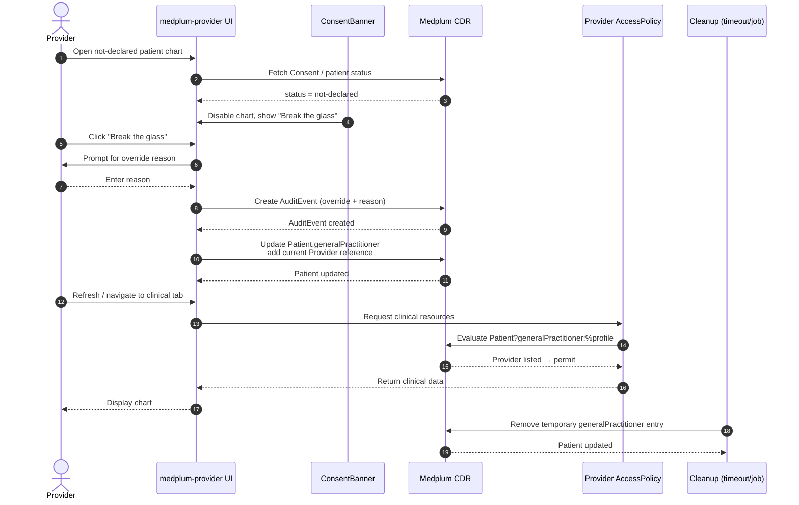

# Nevada HIE Demo — Break-the-Glass Enforcement Options

**Context**: The Nevada HIE demo shows a patient chart even when the patient has not declared a consent preference (`not-declared`). The presenter clicks **Break the glass**, enters a reason, and the chart becomes visible. This document describes four ways to enforce the "no clinical data until break-the-glass" rule, ordered from simplest/least-secure to most-complete.

---

## Option 1: Frontend gating only (quickest, demo-only)

Use the existing `usePatientConsent` hook in the `ConsentBanner` component to conditionally hide chart content until break-glass is recorded.

### How it works

- `ConsentBanner.tsx` already resolves the patient's consent status from a `Consent` resource.
- Extend the logic so that `PatientPage.tsx` does not render `<Outlet />` / `TimelineTab` / clinical tabs while status is `not-declared` and no break-glass `AuditEvent` exists for the current user.
- After the user clicks **Break the glass** and an `AuditEvent` is created, the UI re-renders and shows the chart.

### Pros

- Fastest to implement.
- No backend or AccessPolicy changes required.
- Smooth UX for the demo presenter.

### Cons

- Not secure. A user with a FHIR token can still call the Medplum API directly and retrieve clinical data.
- Only suitable for UI demos, not production or certification.

### Files involved

- `medplum-provider/src/hooks/usePatientConsent.ts`
- `medplum-provider/src/components/consent/ConsentBanner.tsx`
- `medplum-provider/src/pages/patient/PatientPage.tsx`

---

## Option 2: Medplum AccessPolicy + temporary `generalPractitioner`

This is the pattern Medplum documents for ONC-certified emergency access (d6). Break-the-glass temporarily adds the requesting practitioner to `Patient.generalPractitioner`, and the AccessPolicy grants access only when the current user is listed there.

### How it works

1. Provider opens a `not-declared` patient chart and sees a disabled chart.
2. Provider clicks **Break the glass** and enters a reason.
3. The app creates an `AuditEvent` documenting the override.
4. The app also updates the `Patient` resource, adding the provider's `Practitioner` reference to `Patient.generalPractitioner`.
5. The provider AccessPolicy includes a criteria rule such as:
   ```text
   Patient?generalPractitioner:%profile
   ```
   This rule allows access only when the current user's profile is listed in the patient's `generalPractitioner` array.
6. After a timeout or explicit session end, a cleanup process removes the temporary `generalPractitioner` entry.

### Sequence flow



### Pros

- Uses native Medplum authorization primitives.
- Aligns with Medplum's ONC d6 emergency access certification guidance.
- Backend-enforced: direct API calls are also blocked without the temporary relationship.

### Cons

- Requires mutating the `Patient` resource and managing the lifecycle of the temporary relationship.
- The UI may need a refresh after the relationship is added before Medplum re-evaluates the AccessPolicy.
- Cleanup logic must be reliable (timeout, scheduled job, or session-end hook).

### Files involved

- `medplum-ubix/scripts/seed-nevada-hie-demo.mjs` — update provider AccessPolicy with `generalPractitioner` criteria.
- `medplum-provider/src/components/consent/ConsentBanner.tsx` — add Patient update after break-glass.
- `medplum-provider/src/utils/audit.ts` — ensure `AuditEvent` is created.
- Optional cleanup Bot or scheduled job in Medplum.

---

## Option 3: Custom server-side authorization wrapper

Build a HiiveCare-specific middleware or proxy between `medplum-provider` and the Medplum CDR. The wrapper evaluates consent and break-glass status before forwarding clinical-resource requests.

### How it works

1. All provider-app FHIR requests route through the wrapper.
2. For requests involving a patient, the wrapper checks:
   - Does an active `Consent` with `provision.type = permit` exist?
   - If consent is `not-declared`, has the current user recorded a valid break-glass `AuditEvent` for that patient?
3. If neither condition is met, the wrapper returns `403 Forbidden`.
4. If break-glass exists, the wrapper forwards the request and records an additional access `AuditEvent`.

### Pros

- Strongest enforcement: works for all API consumers, not just the React app.
- Can implement HiiveCare-specific business logic (e.g., time-limited override, reason validation).
- Does not depend on Medplum AccessPolicy limitations.

### Cons

- Most development effort.
- Adds a new service/component that must be maintained.
- Duplicates some authorization responsibilities already handled by Medplum.

### Components involved

- New middleware/proxy service (e.g., Express, Fastify, or API Gateway Lambda).
- Consent and `AuditEvent` lookup logic.
- Updated provider app to route through the wrapper.

### Could AWS Cognito replace this?

AWS Cognito is an **identity** service, not an **authorization** service. It can authenticate users and issue JWTs, but it does not understand patient-specific `Consent` resources or break-glass `AuditEvent`s.

So Cognito **cannot directly substitute** for Option 3. However, it can be part of the same architecture:

- **Cognito** authenticates the provider and provides a signed token (who they are).
- **API Gateway** with a **Cognito authorizer** verifies the token at the edge.
- A **Lambda authorizer** (or Lambda proxy integration) then performs the consent/break-glass check (what they may access).
- If the check passes, the request is forwarded to Medplum; otherwise it returns `403 Forbidden`.

In short: Cognito handles authentication; the custom wrapper/authorizer still handles the break-glass authorization decision.

---

## Option 4: Medplum Bot + Subscription

Use a Medplum Bot triggered by an `AuditEvent` creation (break-the-glass) to update the patient's permissions or add a temporary flag. A Subscription listens for break-glass events and executes the Bot.

### How it works

1. Provider clicks **Break the glass**.
2. The app creates an `AuditEvent` with code `BREAK_GLASS`.
3. A Medplum Subscription on `AuditEvent?type=BREAK_GLASS` invokes a Bot.
4. The Bot updates the patient — for example:
   - Adds a temporary extension flag.
   - Adds the provider to `Patient.generalPractitioner` (similar to Option 2).
   - Updates a project-specific `Group` or `AccessPolicy` parameter.
5. The provider AccessPolicy criteria reference the updated patient field or parameter.

### Pros

- Server-side and event-driven.
- Keeps break-glass logic out of the frontend.
- Can be combined with Option 2 for full backend enforcement.

### Cons

- Subscriptions require WebSocket or REST delivery, which may not be enabled in the local build.
- Adds operational complexity (Bot deployment, Subscription management).
- Slight asynchronous delay between break-glass action and permission update.

### Components involved

- Medplum Bot code (TypeScript/JavaScript deployed to Medplum).
- Medplum Subscription resource.
- Updated AccessPolicy criteria.

---

## Recommendation

| Goal | Recommended option |
|---|---|
| Fast demo fix this week | **Option 1** with clear documentation that backend enforcement is pending. |
| Credible production-aligned demo | **Option 2** — uses Medplum ONC-certified emergency access pattern. |
| Maximum security / multi-client enforcement | **Option 3** — custom authorization wrapper. |
| Event-driven, server-side enforcement | **Option 4** (if Subscriptions are enabled) or combine with Option 2. |

For the Nevada HIE demo, **Option 2** is the best balance of credibility and implementation effort because it relies on native Medplum authorization and can be described as the ONC-certified approach.
