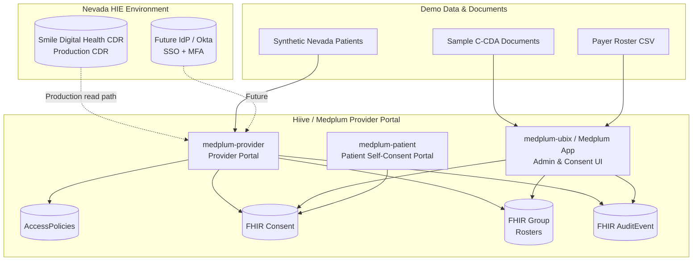

# Nevada HIE Demo Plan

**Opportunity**: HealtHIE Nevada Portal front-end for Smile Digital Health CDR  
**Audience**: Nevada HIE leadership, clinical operations, and technical evaluation team  
**Date**: 2026-07-23  
**Related files**:
- `HealtHIE Nevada Portal_CDR Requirements v2026-07-13.xlsx`
- `Nevada HIE meeting notes.docx`

---

## 1. Executive Summary

Nevada HIE will use Smile Digital Health as the CDR. Smile does not provide a user interface/portal, so Hiive/Medplum will serve as the provider-facing portal. For this demo, we will use Medplum’s native FHIR store as the CDR so we can showcase the full portal experience without building a Smile integration. In production, the portal would read from Smile via FHIR APIs; the same consent, roster, audit, and UI logic applies.

**Primary demo thesis**: Medplum’s native provider portal, AccessPolicy, Consent, roster, audit, and CCDA capabilities satisfy Nevada HIE’s portal requirements using only configuration and built-in features—no custom code.

---

## 2. Requirements-to-Capability Mapping

| Requirement Category | Nevada HIE Requirement | Medplum Native Capability | Demo Notes |
|---|---|---|---|
| **Identity & Access** | MFA (SMS / app authenticator) | Medplum supports external IdP MFA via SAML/OIDC; **out of scope for this demo** | Not configured; note future IdP option |
| **Identity & Access** | Okta IdP / SSO | Native Medplum SSO capability; **out of scope for this demo** | Demo uses native Medplum username/password login |
| **Identity & Access** | Self-service password reset / lockout | Built-in Medplum password reset; auto-lockout via scheduled Bot is **out of scope** | Reset link via email; lockout noted as future |
| **Identity & Access** | Complex password rules | Configurable password policy in Medplum server settings | Show policy config |
| **Patient Identity** | Verato / third-party MPI integration | Native `Patient/$match`; Verato REST integration is **out of scope** | Use built-in `$match` on demographics + identifiers |
| **Patient Identity** | Associated MRNs and orgs | Patient `identifier` array + `Patient.link` + Organization references | Patient header shows all MRNs/sources |
| **Portal / CDR** | Smile Digital Health CDR front end | Medplum provider portal reads a FHIR CDR; demo uses Medplum native CDR | Note production path: portal → Smile FHIR API |
| **Portal** | View messages in process from test and production environments for validation purposes | Medplum `Subscription` on `Bundle`/`Communication` + project separation | Show test/prod project toggle + recent message list |
| **Portal** | Parse CCD/CDAs | `@medplum/ccda` package converts CDA ↔ FHIR | Import sample CDA, render as FHIR resources |
| **Portal** | Query external sources (DOD/VA, Immunization Registry) | Native FHIR gateway via `Questionnaire`/`ServiceRequest` or external Bot; **mocked for demo** | Simulated DOD/VA query (mock) |
| **Consent** | Opt-in / opt-out / not-declared | FHIR `Consent` resource + AccessPolicy rules | Patient banner shows consent status |
| **Consent** | Break-the-glass for not-declared | AccessPolicy with `Consent` exception + `Provenance` logging | Provider clicks “Break glass” → audit entry |
| **Consent** | Medicaid override | AccessPolicy rule: if `Patient.identifier` matches Medicaid payer, allow access regardless of opt-out | Show Medicaid patient accessible despite opt-out |
| **Consent** | Manual consent update | Native `Consent` create/update UI in Medplum app | Provider updates consent status |
| **Rosters** | Provider users search anyone | AccessPolicy scoped by role | Global search enabled for provider role |
| **Rosters** | Payer users search only their roster | AccessPolicy + `Group` membership per payer roster | Payer user logs in, roster-only results |
| **Rosters** | Monthly CSV roster upload | Bulk import into `Group` via CSV upload or scheduled Bot; **CSV upload via built-in admin or Bot** | Upload CSV, show Group members |
| **Rosters** | Encounter list filtered by roster | Dashboard default last 30 days, filter by visit type, sort by name/date | Roster dashboard with filters |
| **User Provisioning** | Bulk upload users/orgs/sub-orgs | Built-in Medplum admin CSV invite | Bulk invite flow |
| **User Provisioning** | Add/remove/edit users | Built-in Medplum admin UI | Admin screen demo |
| **User Provisioning** | Retain contact/role/NPI/license/identifiers | `Practitioner`, `ProjectMembership`, `Organization` resources | User profile shows all fields |
| **Auditing** | Audit PHI access by admins | Medplum `AuditEvent` (generated automatically) | Export admin access report |
| **Auditing** | Audit trail: searches, docs viewed/exported, consent updates | `AuditEvent` + `Provenance` | Drill-down per user/patient |
| **Reporting** | Usage reports: chart views/queries by user/org | FHIR search on `AuditEvent`; no external BI required | Dashboard widgets |
| **CDR** | Consume HL7 v2 and CDA | `@medplum/ccda` for CDA; HL7 v2 ingestion is **out of scope** for Smile demo | Ingest sample CDA via `$ccda-import`-style flow |
| **CDR** | Store data natively | Medplum FHIR server | Standard resources |
| **CDR** | Support FHIR resources natively | Full FHIR R4 store + custom resources/profiles | Search/read/write |
| **CDR** | Generate CDA document | `$ccda-export` operation | Export patient CDA |
| **CDR** | Stable documents in Document Query response | `DocumentReference` + binary storage | Query returns stable URLs |
| **CDR** | Reports for auditing who accessed what | `AuditEvent` reporting | Canned reports |

---

## 3. Demo Storyline

**Personas**:
- **Dr. Alex** — provider user, full access
- **Sarah** — payer roster user, limited to her roster
- **Jordan Riley** — patient (opt-in)
- **Taylor Smith** — patient (not declared, break-the-glass required)
- **Casey Rivera** — patient (opt-out, but Medicaid override applies)

### Act 1: Provider Login & Patient Search (5 min)
1. Dr. Alex signs in with native Medplum credentials into `medplum-provider` portal. (SSO/Okta is not configured for the demo; note it is supported.)
2. Search for patient by name/DOB/MRN.
3. Patient header shows all associated MRNs and source organizations.
4. Consent status banner: green (opt-in), yellow (not declared), red (opt-out).

### Act 2: Consent Enforcement (7 min)
1. Open opt-in patient → full chart loads.
2. Open not-declared patient → click “Break the glass”, enter reason; chart loads and `AuditEvent` is written.
3. Open opt-out Medicaid patient (Casey Rivera) → chart loads automatically with Medicaid override banner.
4. Update consent manually → status changes and is audited.

### Act 3: Roster-Based Access (5 min)
1. Log in as Sarah (payer roster user).
2. Dashboard defaults to last 30 days for her roster only.
3. Search for a patient not on her roster → no results / access denied.
4. Filter encounters by visit type, sort by patient name and encounter date.

### Act 4: CDR Ingest & Document View (6 min)
1. Upload a C-CDA document via admin UI. (HL7 v2 ingest and Smile connectivity are not part of the demo; production will read from Smile.)
2. Show the CDA transformed into FHIR `Patient`, `Encounter`, `Observation`, `Condition`, `DocumentReference`.
3. Open patient timeline; documents are linked.

### Act 5: CDA Export (3 min)
1. From the patient chart, click “Export C-CDA”.
2. Medplum `$ccda-export` generates and downloads a CDA XML file.

### Act 6: Audit & Reporting (4 min)
1. Admin opens audit dashboard.
2. Filter `AuditEvent` by user, patient, date range.
3. Export CSV of searches, documents viewed/exported, consent updates.
4. Show usage report: chart views and queries per user/organization.

---

## 4. Technical Implementation Plan

### 4.1 Repos & Branches
- `medplum-ubix`: core Medplum app, AccessPolicies, CCDA conversion
- `medplum-provider`: provider portal demo UI
- `medplum-patient`: patient portal (for opt-in/opt-out self-consent if desired)
- `hiivecare-dev-data-pipeline`: synthetic Nevada demo data

Base branch: `main`; work in existing branch `feature/nevadahie`.

**Custom code policy**: This demo uses only native Medplum features. The only optional scripts are standard data-loading/seed utilities similar to existing `load-soap-questionnaires.mjs` and `curate-occhealth-demo.mjs`.

### 4.2 Configuration Tasks (Native Medplum Only)
1. **AccessPolicies**
   - `provider-access`: read/search all patients, encounters, documents, consents.
   - `payer-roster-access`: read/search only patients in assigned `Group`.
   - `admin-access`: user provisioning, audit export.
   - Consent rules: evaluate `Consent` status + Medicaid exception.
   - *SSO/Okta is out of scope; demo uses native Medplum authentication.*

2. **Consent Model**
   - Create `Consent` resources with categories:
     - `opt-in`
     - `opt-out`
     - `not-declared`
   - Add `Patient.identifier` for Medicaid payer to trigger override.
   - Break-the-glass writes `Provenance` + `AuditEvent`.

3. **Roster Model**
   - `Group` per payer with `member.entity` references to `Patient`.
   - Bulk upload roster CSV into `Group` via existing Medplum admin tools.
   - Dashboard searches filter by `Group` membership.

4. **CDR Ingest (Demo Only)**
   - C-CDA → FHIR using `@medplum/ccda` package.
   - Document Query returns `DocumentReference` with stable `Binary` URLs.
   - *HL7 v2 ingest and Smile integration are out of scope for the demo.*

5. **MPI (Demo Only)**
   - Use built-in `Patient/$match` operation on demographics and identifiers.
   - *Verato integration is out of scope.*

6. **Audit & Reporting**
   - `AuditEvent` is generated automatically by Medplum on reads/searches.
   - Use FHIR search on `AuditEvent` for usage reports; export to CSV via built-in UI or simple script.

### 4.3 UI Components to Configure/Extend
- Consent banner in patient header.
- Break-the-glass modal with reason capture.
- Roster dashboard with date/visit-type filters.
- Audit dashboard with export.
- C-CDA import/export buttons.
- User provisioning admin page.

### 4.4 Synthetic Demo Data
Use `hiivecare-dev-data-pipeline` to generate:
- 100 Nevada patients with varied consent states.
- 2 provider users, 2 payer roster users.
- Sample C-CDA documents.
- Medicaid identifiers for override examples.
- *HL7 v2 messages are not needed for the demo.*

---

## 5. Demo Environment

| Component | URL | Notes |
|---|---|---|
| Medplum app (admin) | `http://localhost:3001/` | use port 3001 because 3000 is occupied |
| Provider portal | `http://127.0.0.1:5172/` | Native Medplum login for demo; SSO noted as future |
| Patient portal | `http://127.0.0.1:5173/` | optional self-consent view |
| Backend | `https://api.ehr.hiivehealth.net/` | Hiive build environment |
| Target project | `7e472dfd-3ab9-4b75-adac-38e0c5c5d6c8` | Ubix Data provider project |

---

## 6. Risks & Gaps

| Risk | Mitigation |
|---|---|
| Smile CDR not integrated | Demo uses Medplum native CDR; clearly communicate production hand-off |
| Okta integration not available in build env | Out of scope; demo with native Medplum username/password |
| Verato API access unavailable | Out of scope; use built-in `Patient/$match` |
| DOD/VA real connectivity unavailable | Mock external query in demo |
| Immunization registry unavailable | Mock external query in demo |
| 90-day inactivity lockout not in core Medplum | Out of scope; note it requires a scheduled Bot or IdP |
| Password-policy UI limited | Show server config file/API |

---

## 7. Architecture

---

## 8. AI-Agent Work Slices

The demo is broken into independent slices that can be assigned to AI agents. Each slice produces a verifiable outcome and uses only native Medplum capabilities.

### Slice 1: Seed Nevada Demo Data
- **Goal**: Create 100 synthetic Nevada patients with varied consent states, provider users, payer roster users, and Medicaid identifiers.
- **Inputs**: `hiivecare-dev-data-pipeline` generator patterns.
- **Outputs**: FHIR `Patient`, `Practitioner`, `ProjectMembership`, `Organization`, `Consent`, and `Group` resources in the Ubix Data project.
- **Verification**: Run `verify-nevada-demo-data.mjs`; confirm counts and consent distributions.

### Slice 2: AccessPolicies for Provider and Payer Roster Roles
- **Goal**: Configure AccessPolicies that enforce provider full-access vs. payer roster-limited access.
- **Inputs**: Target project ID, payer `Group` references, role definitions.
- **Outputs**: `AccessPolicy` resources for `provider-access`, `payer-roster-access`, and `admin-access`.
- **Verification**: Log in as provider user (sees all patients) and payer roster user (sees only roster patients).

### Slice 3: Consent Model and Break-the-Glass
- **Goal**: Implement opt-in / opt-out / not-declared consent states, break-the-glass flow, and Medicaid override.
- **Inputs**: Consent categories, Medicaid payer identifier system, `Provenance` reason codes.
- **Outputs**: `Consent` resources, patient header consent banner, break-the-glass modal, `AuditEvent` entries.
- **Verification**: Open patients in each consent state; confirm access behavior and audit trail.

### Slice 4: Roster Dashboard
- **Goal**: Build a dashboard that lists encounters for a payer’s roster, default last 30 days, with visit-type filters and sorting.
- **Inputs**: `Group` membership, `Encounter` search parameters.
- **Outputs**: Roster dashboard page in `medplum-provider`.
- **Verification**: Payer user logs in, sees only roster encounters, filters/sorts as required.

### Slice 5: C-CDA Import and Patient Timeline
- **Goal**: Import a C-CDA document via `@medplum/ccda`, convert to FHIR resources, and display in patient timeline.
- **Inputs**: Sample C-CDA XML files.
- **Outputs**: Imported `Patient`, `Encounter`, `Observation`, `Condition`, `DocumentReference`; admin import UI; timeline integration.
- **Verification**: Import sample CDA, open patient, confirm resources and documents render.

### Slice 6: C-CDA Export
- **Goal**: Export a patient record as a C-CDA document using Medplum’s `$ccda-export` operation.
- **Inputs**: Patient resource ID.
- **Outputs**: “Export C-CDA” button in provider portal; downloaded CDA XML.
- **Verification**: Click export, validate XML opens and contains expected sections.

### Slice 7: Audit Dashboard and Usage Reports
- **Goal**: Build an admin audit dashboard showing searches, document views/exports, and consent updates; export to CSV.
- **Inputs**: `AuditEvent` resources generated by Medplum.
- **Outputs**: Audit dashboard with filters by user, patient, date range; usage widgets for chart views and queries.
- **Verification**: Perform searches/views/consent updates, then confirm they appear in audit dashboard and export.

### Slice 8: Demo Script and User Provisioning Admin
- **Goal**: Finalize demo script, bulk-user provisioning flow, and admin user-management screens.
- **Inputs**: Personas and storyboard from Section 3.
- **Outputs**: Bulk invite CSV flow, admin user list/edit page, rehearsed demo script.
- **Verification**: Walk through all demo acts end-to-end; confirm timing and transitions.

---

## 9. Next Steps

1. Review and approve this plan with internal Hiive stakeholders.
2. Confirm whether Nevada HIE can provide:
   - De-identified sample HL7 v2 / CDA messages
   - Sample roster CSV format
   - Okta test tenant or metadata
3. Assign AI agents to each work slice in Section 8.
4. Verify each slice independently before assembling the full demo flow.
5. Rehearse the demo storyline from Section 3 end-to-end.

---

## 9. Reference Credentials

- **Provider demo**: `ubix.provider.alex@example.com` / `Hiive-7jhSWuhQA83-dGrUYkqZrtNE!6`
- **Patient demo**: `ubix.patient.riley@example.com` / `Hiive-2pQe87kFXKzlRcC8wmx0GBeo!6`
- **Ubix Data ClientApplication**: `69a636e6-b110-4de7-ac73-4c2b642b48a2` (use for seed data loading)
