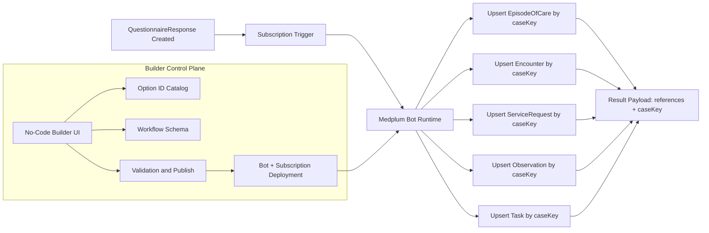
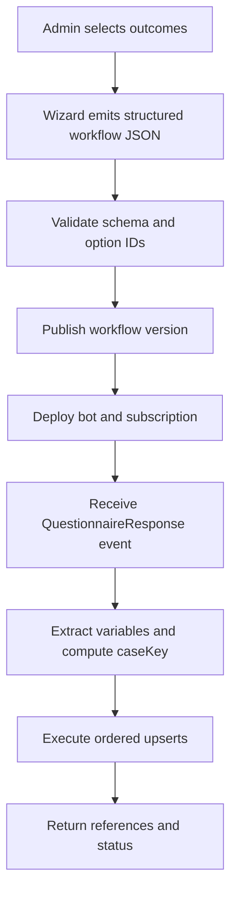
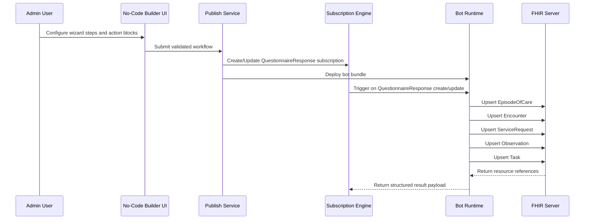
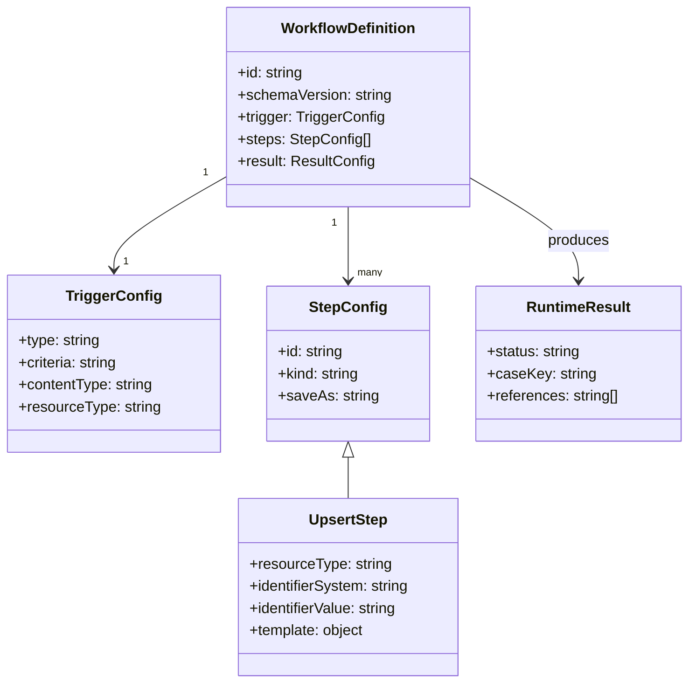

# No-Code Bot Builder UI Map

This document maps a no-code builder UI to the v1 workflow schema and shows exactly how to model Occupational Incident Intake Processor behavior.

Related artifacts:
- Schema: [documents/no-code-bot-builder/workflow-schema-v1.json](documents/no-code-bot-builder/workflow-schema-v1.json)
- Example workflow: [documents/no-code-bot-builder/examples/occupational-incident-intake.workflow.json](documents/no-code-bot-builder/examples/occupational-incident-intake.workflow.json)
- Capability catalog: [documents/bot-action-catalog.md](documents/bot-action-catalog.md)
- Step 6 option enumerations: [documents/no-code-bot-builder/step-6-resource-option-enumerations-v1.md](documents/no-code-bot-builder/step-6-resource-option-enumerations-v1.md)
- Option ID catalog: [documents/no-code-bot-builder/option-id-catalog-v1.md](documents/no-code-bot-builder/option-id-catalog-v1.md)
- Versioning policy: [documents/no-code-bot-builder/versioning-and-compatibility-policy.md](documents/no-code-bot-builder/versioning-and-compatibility-policy.md)

## High-Level Occupational Intake Bot Architecture

## Configuration to Runtime Workflow

## End-to-End Sequence

## Builder Domain Model

## Product Goal

Allow an admin to configure bot behavior without writing code by composing typed action blocks.

## Platform-First Principle

Default to native Medplum features first:
- Subscriptions for event triggers.
- Bot execute and custom FHIR operations for invocation.
- FHIR CRUD and transaction/batch patterns for data changes.
- AccessPolicy, runAsUser, and project settings for authorization.
- Questionnaire and QuestionnaireResponse patterns for structured intake.

Custom extensions are allowed only when no native Medplum feature can satisfy the requirement.

## Input Modality Rule

Hard UX rule for v1:
- Free text allowed only for bot name and bot description.
- All other fields must use structured inputs only: dropdown, radio, checklist, multiselect, date picker, or constrained token/function builders.
- No raw free-form text areas for trigger logic, mapping rules, or resource construction in v1.

## First Question in Wizard

First wizard question should be outcome-oriented and structured:
- Prompt: "What should this bot do when triggered?"
- Control type: Multi-select checklist.
- Option source: Catalog of action templates.

Starter options:
- Create or upsert EpisodeOfCare
- Create or upsert Encounter
- Create or upsert ServiceRequest
- Create or upsert Task
- Create or upsert Observation
- Send notification
- Generate document
- Call external API
- Update existing resource

Occupational Incident Intake Processor default selection:
- EpisodeOfCare
- Encounter
- ServiceRequest
- Task
- Observation

## Information Architecture

Primary pages:
- Workflow List
- Workflow Builder
- Step Inspector
- Run Preview and Dry Run
- Validation and Publish

Builder layout:
- Left rail: Action palette
- Center canvas: Ordered flow graph
- Right rail: Step configuration form
- Bottom panel: Validation, logs, and output preview

## Action Palette v1

Trigger blocks:
- Subscription trigger
- Execute endpoint trigger
- Cron trigger
- Webhook trigger
- Custom operation trigger

Data blocks:
- Extract QuestionnaireResponse
- Set variable
- If condition

FHIR blocks:
- Create resource
- Upsert by identifier

Output blocks:
- Return object
- Return resource
- Return operation outcome

## Step Inspector Forms

### Trigger form

Fields:
- Trigger type
- Subscription criteria or cron expression or operation code
- Input content type
- Input resource type

Schema mapping:
- workflow.trigger
- workflow.input

### Extract QuestionnaireResponse form

Fields:
- Mapping rows
- Each row: target variable, source type, linkId, required flag, fallback, optional choice map

Schema mapping:
- steps[kind=extract.questionnaireResponse].mappings

### Set variable form

Fields:
- Assignment rows
- Expression helper chips: ref, concat, lower, now

Schema mapping:
- steps[kind=logic.setVar].assign

### Upsert by identifier form

Fields:
- Resource type
- Identifier system template
- Identifier value template
- Save-as handle
- Resource template JSON editor with variable insertion helper

Schema mapping:
- steps[kind=fhir.upsertByIdentifier]

### If condition form

Fields:
- Boolean expression
- Then branch sub-steps
- Else branch sub-steps

Schema mapping:
- steps[kind=logic.if]

### Result form

Fields:
- Result mode
- Result payload template

Schema mapping:
- workflow.result

## Validation Rules for Publish

Hard validation:
- Valid schema version.
- At least one trigger and one step.
- Every step id unique.
- Every saveAs unique.
- Every expression references existing variables or step handles.
- Every resource type is valid and writable in schema enum.
- Upsert identifier system and value required.

Safety validation:
- Warn if trigger is subscription and no idempotent key is used.
- Warn if Task owner is missing when creating Task.
- Warn if Observation status or code missing.

## Occupational Incident Intake Processor Mapping

The provided example config models these outputs:
- EpisodeOfCare
- Encounter
- ServiceRequest
- Observation
- Task

How it is represented:
- One extract step maps patient and questionnaire answers to variables.
- One derive step creates deterministic caseKey.
- Five upsert steps each use case identifier system plus caseKey.
- Result payload returns references to all five resources.

## UX Sequence for Admin User

1. Choose bot name Occupational Incident Intake Processor.
2. Pick trigger Subscription and select QuestionnaireResponse criteria.
3. Add Extract QuestionnaireResponse step and map linkIds.
4. Add Set variable step and define caseKey formula.
5. Add five Upsert by identifier steps for EpisodeOfCare, Encounter, ServiceRequest, Observation, Task.
6. Configure result payload.
7. Run Dry Run with sample QuestionnaireResponse.
8. Fix validation issues.
9. Publish.

## Suggested Next Build Slice

Implement only these capabilities first:
- Trigger type Subscription
- Extract QuestionnaireResponse step
- Set variable step
- Upsert by identifier step
- Result object step

This subset is enough to replace the current Occupational Incident Intake Processor coded flow with no-code configuration.
