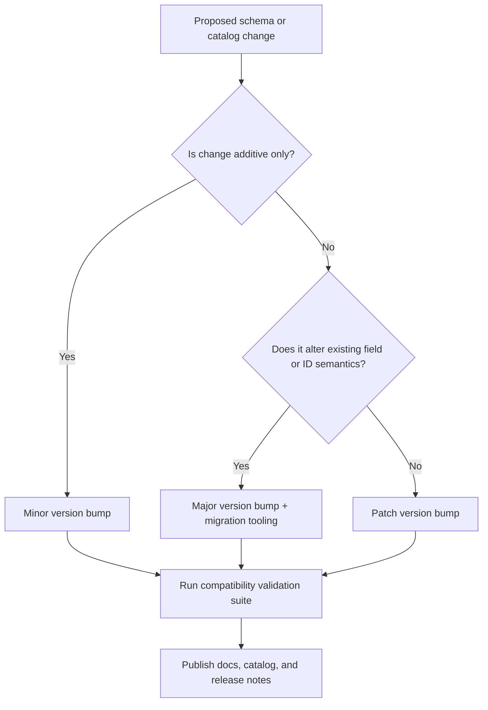
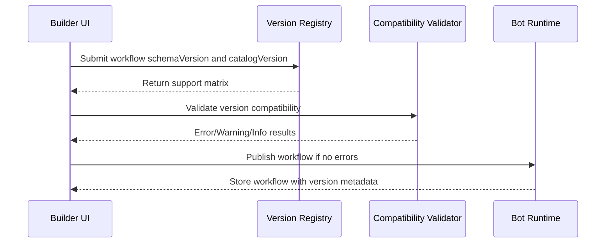
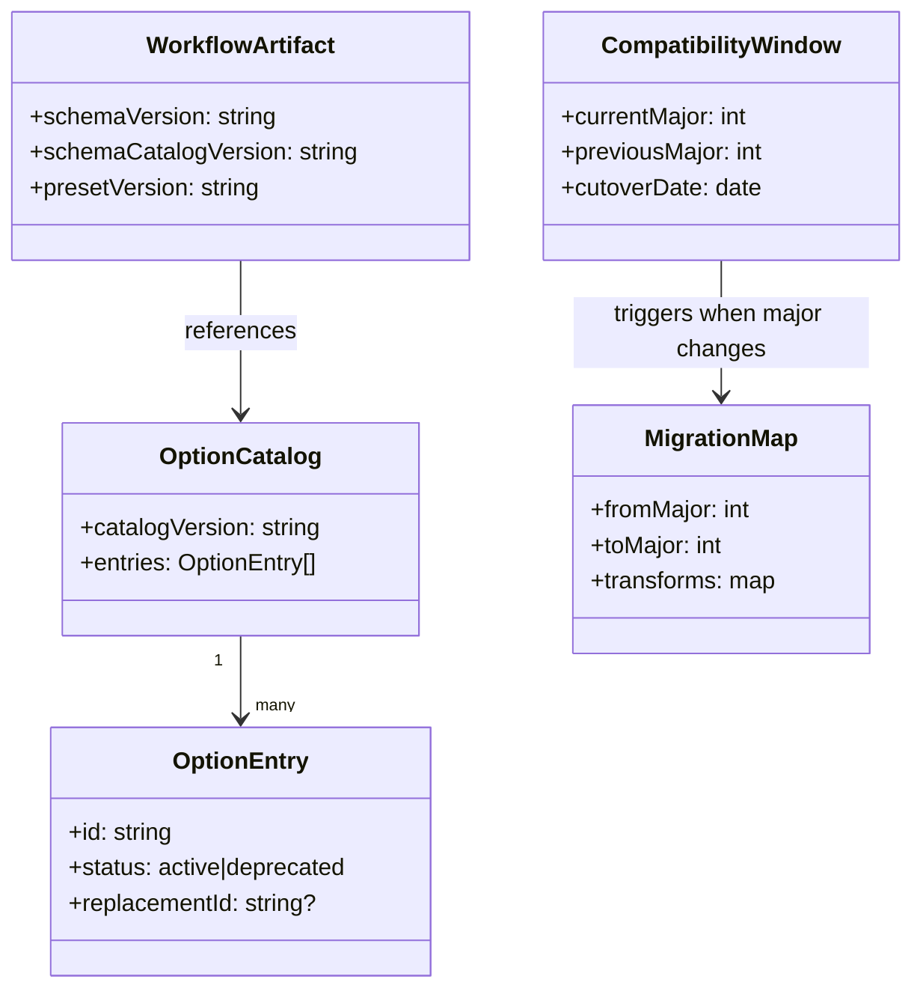

# No-Code Builder Versioning and Compatibility Policy

This policy defines how workflow schema and option catalogs evolve without breaking existing configured bots.

## Goals

- Preserve execution behavior of published workflows.
- Allow UI label and documentation improvements without data migrations.
- Enable additive feature rollout with predictable compatibility.
- Prefer Medplum-native features and keep custom extension surfaces minimal.

## Compatibility Decision Workflow

## Runtime Compatibility Sequence

## Versioning Model

## Versioned Artifacts

The following are independently versioned:
- Workflow schema
- Option ID catalog
- UI wizard presets

Current baseline:
- Workflow schema version: 1.0
- Option catalog version: 1.0

## Compatibility Rules

### Rule 1: Additive is backward compatible

Allowed without major bump:
- Add new optional fields.
- Add new option IDs.
- Add new presets.
- Add new validation warnings that do not block existing valid configs.

### Rule 2: Breaking changes require major version

Requires major bump:
- Remove a field.
- Rename a field.
- Change field type.
- Remove an option ID.
- Change semantics of an existing option ID.

### Rule 3: Option IDs are immutable

- Once released, option IDs never change.
- Labels may change anytime.
- Deprecated IDs remain executable.

### Rule 4: Deprecation lifecycle

For any deprecated field or option ID:
- Phase A: Mark deprecated in docs and UI.
- Phase B: Hide from new workflow creation.
- Phase C: Keep runtime support for at least one major cycle.
- Phase D: Remove only in a major version with migration tooling.

### Rule 5: Runtime compatibility target

Runtime must support:
- Current major version.
- Previous major version during transition window.

## Schema Versioning Model

Use semantic versioning:
- Major: breaking change.
- Minor: backward-compatible feature additions.
- Patch: clarifications and non-functional fixes.

Workflow payload fields:
- schemaVersion: required major.minor string
- optional metadata:
- schemaCatalogVersion
- presetVersion

## Option Catalog Versioning Model

Catalog fields:
- catalogVersion
- generatedAt
- entries

Entry fields:
- id
- label
- status: active or deprecated
- replacementId: optional

## Migration Policy

### Minor upgrades

- No migration required.
- UI may offer optional normalization.

### Major upgrades

- Provide migration map document.
- Provide deterministic transform tool.
- Keep execution fallback for previous major until cutover date.

## Validation Policy

Validation levels:
- Error: blocks publish.
- Warning: allows publish.
- Info: advisory.

Compatibility-specific checks:
- Error if unknown major schemaVersion.
- Warning if deprecated option ID is used.
- Info if a replacementId is available.

## Release Checklist

Before releasing schema or option changes:
- Update versioned docs.
- Update catalog entries and deprecations.
- Validate existing example workflows still parse.
- Validate occupational intake preset still resolves to valid IDs.
- Publish migration notes if required.

## Occupational Intake Stability Contract

The preset preset.occupational_incident_intake.v1 must remain stable for v1.x:
- Same five action resources.
- Same idempotency strategy using case key.
- Same reference chaining across EpisodeOfCare, Encounter, ServiceRequest, Observation, and Task.

If any of the above semantics change, publish a new preset version:
- preset.occupational_incident_intake.v2
