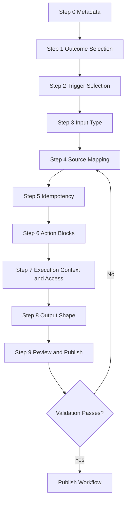
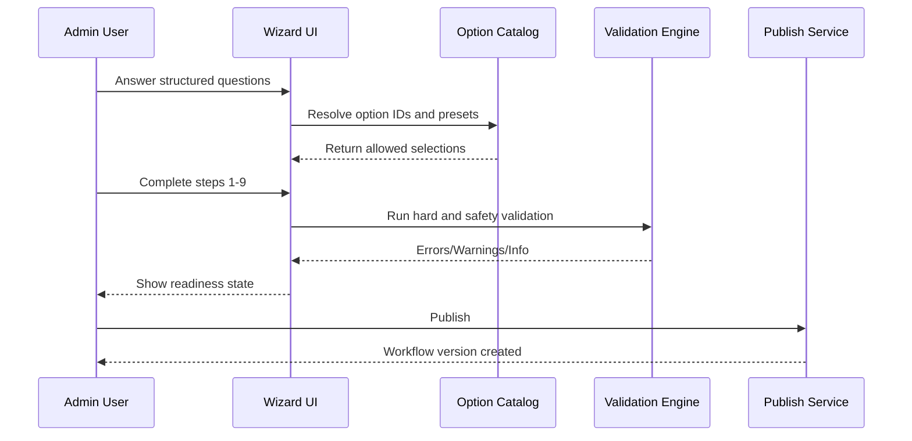
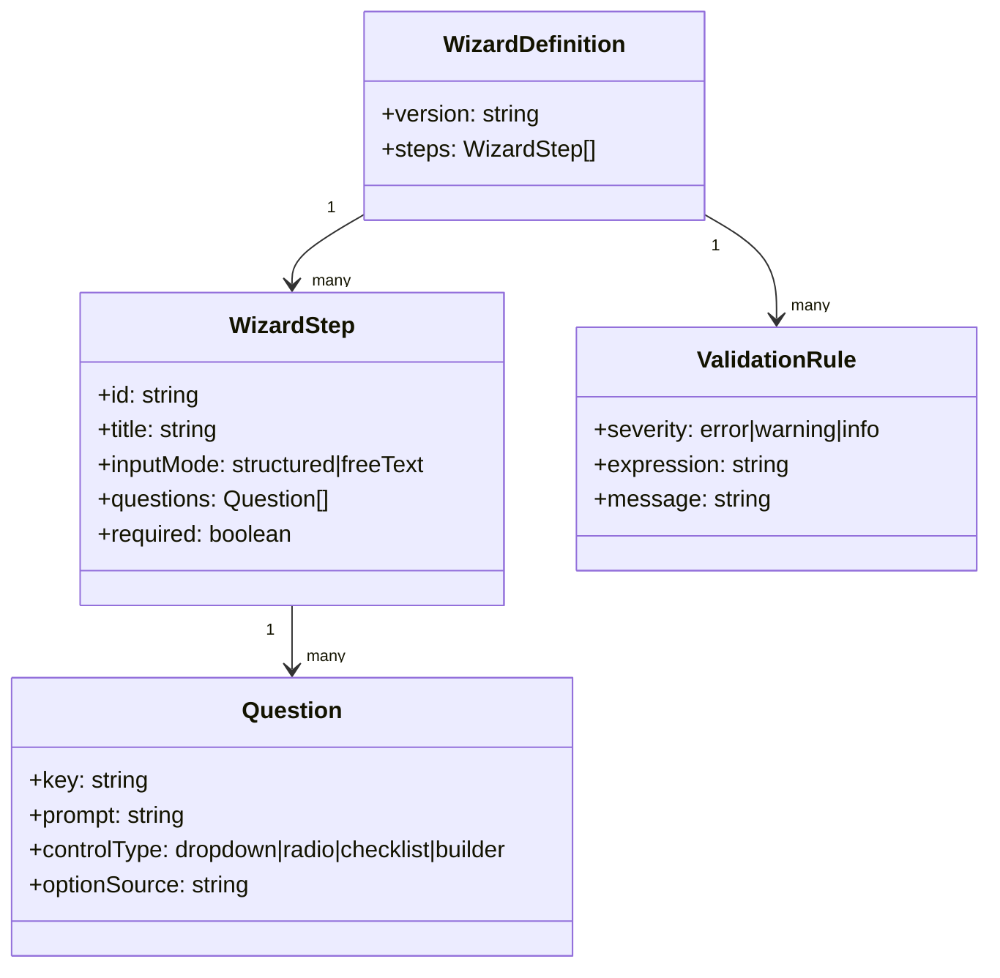

# No-Code Bot Builder Wizard v1 Question Model

This document defines structured-only wizard questions for bot creation.

Rule:
- Only bot name and bot description are free text.
- Every other answer uses structured choices.
- Use native Medplum capabilities first. Only allow custom actions if no native feature can meet the need.

Step 6 option catalog:
- [documents/no-code-bot-builder/step-6-resource-option-enumerations-v1.md](documents/no-code-bot-builder/step-6-resource-option-enumerations-v1.md)

Versioned references:
- [documents/no-code-bot-builder/option-id-catalog-v1.md](documents/no-code-bot-builder/option-id-catalog-v1.md)
- [documents/no-code-bot-builder/versioning-and-compatibility-policy.md](documents/no-code-bot-builder/versioning-and-compatibility-policy.md)

## Wizard Workflow Diagram

## Wizard Interaction Sequence

## Wizard Model Diagram

## Step 0: Bot Metadata

Question:
- Bot name
- Bot description

Input type:
- Free text fields.

## Step 1: Outcome Selection (First Structured Question)

Question:
- What should this bot do when triggered?

Input type:
- Multi-select checklist.

Allowed options v1:
- Create or upsert EpisodeOfCare
- Create or upsert Encounter
- Create or upsert ServiceRequest
- Create or upsert Task
- Create or upsert Observation
- Create or upsert Communication
- Create or upsert DocumentReference
- Create or upsert CarePlan
- Call external API
- Send notification

Occupational Incident Intake Processor selection:
- Create or upsert EpisodeOfCare
- Create or upsert Encounter
- Create or upsert ServiceRequest
- Create or upsert Task
- Create or upsert Observation

## Step 2: Trigger Selection

Question:
- How should this bot be triggered?

Input type:
- Single-select radio.

Allowed options:
- Subscription event
- Manual execute endpoint
- Cron schedule
- Webhook endpoint
- Custom FHIR operation

Occupational Incident Intake Processor selection:
- Subscription event

## Step 3: Input Type

Question:
- What input does this bot read?

Input type:
- Structured select pairs.

Allowed content types:
- application/fhir+json
- x-application/hl7-v2+er7
- application/json
- text/plain

Allowed primary resource for FHIR input:
- QuestionnaireResponse
- Patient
- Observation
- Encounter
- Task
- ServiceRequest
- Communication

Occupational Incident Intake Processor selection:
- contentType: application/fhir+json
- resourceType: QuestionnaireResponse

## Step 4: Source Mapping

Question:
- Which fields should be extracted from the input?

Input type:
- Row builder with dropdowns only.

Row fields:
- Target variable (select or create from constrained naming rule)
- Source kind (subjectReference, linkId.choice, linkId.string, linkId.date, linkId.dateTime)
- linkId (dropdown sourced from Questionnaire definition)
- Required flag (toggle)
- Fallback value (choice from allowed set when applicable)

## Step 5: Idempotency

Question:
- How do we prevent duplicate case creation?

Input type:
- Structured key builder.

Allowed key parts:
- Patient reference
- Incident date/time
- Incident type
- Component
- Duty location

Allowed combination operators:
- concat with delimiter
- normalize lower

## Step 6: Action Blocks

Question:
- Configure each selected action.

Input type:
- Per-action forms with constrained fields.

Common fields:
- Resource type (fixed by chosen outcome)
- Identifier system (select from known naming systems)
- Identifier value (token builder using key parts)
- Resource template fields (FHIR-aware form controls; no raw JSON in v1)
- Save handle (generated)

## Step 7: Execution Context and Access

Question:
- Which execution context and policy should apply?

Input type:
- Structured selects.

Allowed options:
- Execution mode: bot-membership or run-as-user
- Access policy: select existing AccessPolicy
- Least-privilege helper: auto-suggest based on chosen actions and resources

## Step 8: Output Shape

Question:
- What result payload should this bot return?

Input type:
- Structured output template selector.

Allowed options:
- Standard status object
- Resource reference list
- OperationOutcome

Occupational Incident Intake Processor output preset:
- status
- caseKey
- episode reference
- encounter reference
- serviceRequest reference
- observation reference
- task reference

## Step 9: Review and Publish

Question:
- Are all required selections complete and valid?

Input type:
- Validation checklist with pass/fail rows.

Required checks:
- Trigger configured
- Input mapping complete
- Idempotency key configured
- All selected actions fully configured
- Access policy selected
- Dry run passes
